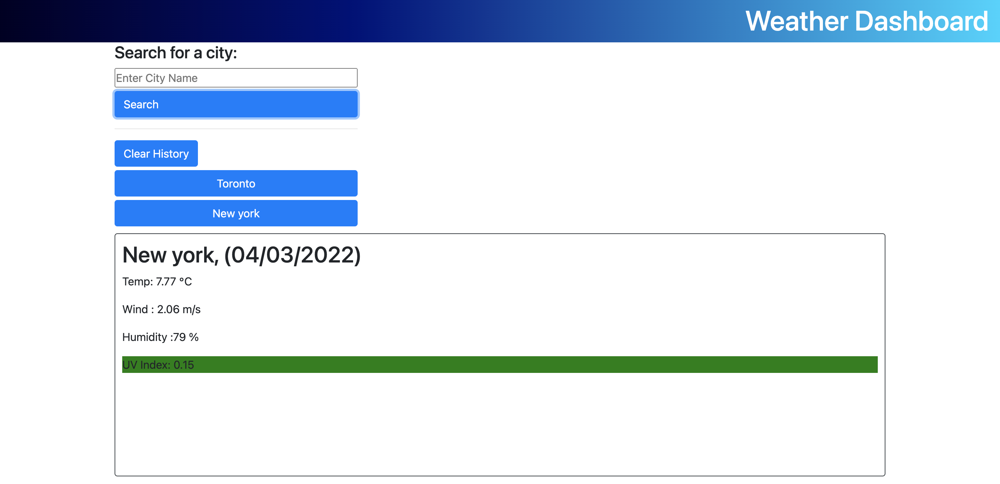
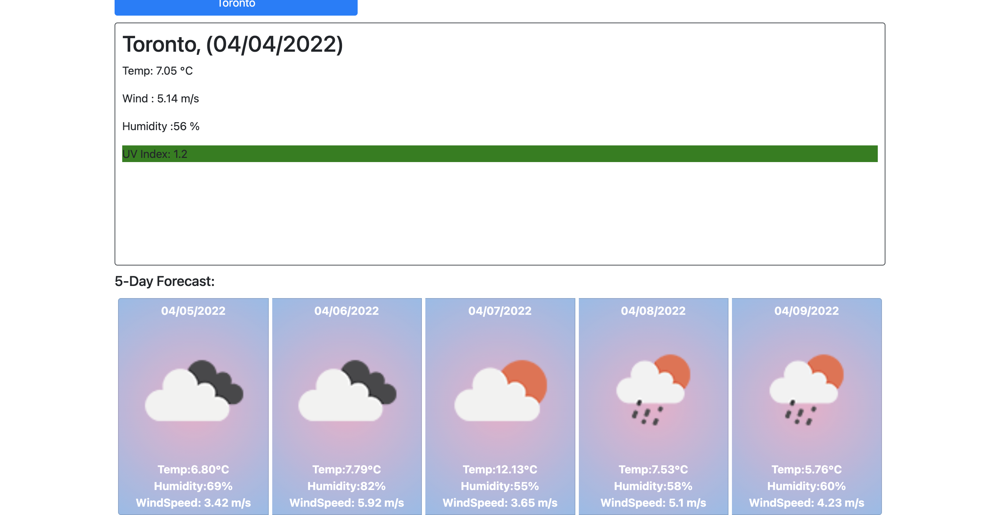

# Weather Application

Weather app lets users search the weather for the city of their choice and display current and five day forecast along with:

- Temperature.
- WindSpeed.
- Humidity
- Current UV index.

App also saves most recent searches and creates shortcut for the recent searches to view city weather upon a click of a button.

# Deployment Link

https://katochsenthal.github.io/weatherApp/

#

# Preview

# Technologies Used.

- HTML
- CSS
- BOOTSTRAP
- JAVASCRIPT
- JQUERY
- OPEN WEATHER_APP

# Credits

Senthol
